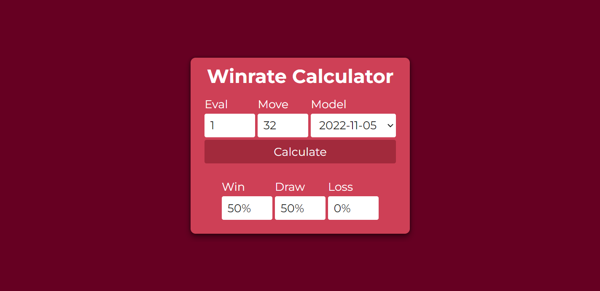

# Elo Calculator

https://dav1312.github.io/Chess/EloCalculator

A simple Elo calculator based on [3dkingdoms's Elo Calculator](https://www.3dkingdoms.com/chess/elo.htm).

---

# Winrate Calculator

https://dav1312.github.io/Chess/WinrateCalculator

Calculate the win/draw/loss percentages using Stockfish's eval and move number.

---

# Stockfish Commits

https://dav1312.github.io/Chess/StockfishCommits

See all of the Stockfish commits and download the latest version.

---

# Eval Bar

https://dav1312.github.io/Chess/EvalBar

An example of a dynamic evaluation bar.

---

# Stockfish Graphviz

https://dav1312.github.io/Chess/StockfishGraphviz

Helper website to fix the output of [Stockfish Graphviz](https://github.com/Disservin/Stockfish/tree/graphvizTREEFILE).
